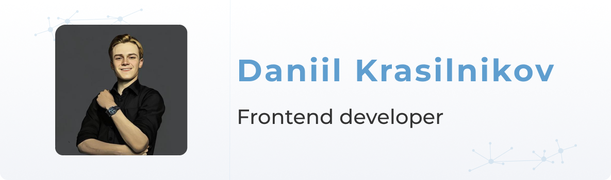

<h1 align="center">Hi there, I'm <a href="https://krasilnikov.info" target="_blank">Daniil</a> 
</h1>
<h3 align="center">Frontend Engineer | IoT & Robotics Enthusiast</h3>

    <em>"The future will belong to those who believe in the beauty of their dreams."</em>

---

<h2 align='left'>Key Points:</h2>
<ul>
    <li>🌟 Open for freelance orders</li>
    <li>🇳🇱 Open for job opportunities in the Netherlands</li>
    <li>🤖 Passionate about Robotics and IoT</li>
</ul>

---

<h2 align='left'>📅 Let’s Have a Call:</h2>

---

    I’m truly passionate about <strong>IoT</strong> and <strong>Robotics</strong>. Collaborating on projects, startups, and companies in these fields brings me joy and fulfillment. My goal is to craft solutions that push boundaries, improve lives, and inspire!

    I thrive on building complex systems and thinking about big ideas. My ultimate dream is to establish my own robotics company, where technology meets creativity to shape a better future for all.

---

<h3>🔧 Frontend Stack:</h3>
<ul>
    <li>React.js, Next.js, React Native</li>
    <li>Svelte, SvelteKit</li>
    <li>TypeScript, JavaScript (ES6+)</li>
    <li>HTML5, CSS3, TailwindCSS</li>
    <li>Webpack, Vite, Babel</li>
    <li>Microservices Architecture</li>
</ul>

<h3>💾 Backend Stack:</h3>
<ul>
    <li>Node.js, Express.js</li>
    <li>RESTful APIs, GraphQL</li>
    <li>MongoDB, PostgreSQL</li>
    <li>WebSockets, MQTT</li>
    <li>Docker</li>
</ul>

<h3>🤖 IoT and Robotics Stack:</h3>
<ul>
    <li>Arduino, ESP32, Raspberry Pi</li>
    <li>IoT Protocols: MQTT, HTTP, WebSockets</li>
    <li>Hardware Integration: Sensors, Actuators</li>
    <li>Microcontrollers and Embedded Systems</li>
</ul>

---

<h3>🌟 My Portfolio:</h3>
<ul>
    <li><a target="_blank" href="https://terra.do">Terra.do</a> - Climate education platform</li>
<!--     <li><a target="_blank" href="https://clipflip.video">ClipFlip</a> - Video marketing SaaS</li> -->
    <li><a target="_blank" href="https://mobioffice.io">Mobioffice</a> - Business solutions SaaS</li>
    <li><a target="_blank" href="https://kgirdharlal.com">Kgirdharlal</a> - Jewelry e-commerce store</li>
</ul>

<h3>🚀 Featured Projects:</h3>
<ul>
    <li>Meds Recognition App</li>
    <li>Electronics Education Platform</li>
</ul>

---

    Feel free to explore my repositories, fork my projects, or connect with me to collaborate. Together, we can build something truly remarkable! 🚀

---

<h2 align='left'>🌐 Connect With Me:</h2>

    
    
    
    

---

    

---

<h3 align="center">📊 GitHub Stats:</h3>

    

